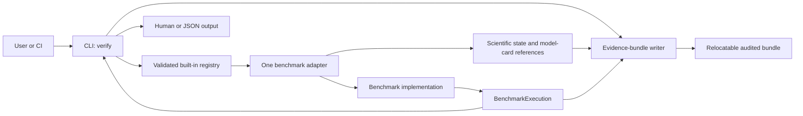

# HoloForge architecture

HoloForge is a verification-first scientific framework. Its executable
Forge/Verify core is a deterministic benchmark harness, but the repository also
contains scientific contracts, provenance schemas, evidence auditing, and the
governed Explore workflow. It is therefore broader than a generic test harness.

## Execution path

The generic path standardizes command configuration, dispatch, pass/fail
handoff, rendering, and evidence generation. It does not standardize equations,
boundary conditions, solver signatures, or scientific acceptance gates.

## Repository layers

| Layer | Location | Responsibility |
| --- | --- | --- |
| Scientific authority | `CONSTITUTION.md`, `docs/scientific-support.md`, version contracts | Defines evidence, review, claim, and privacy rules. |
| Public model records | `domains/` | Keeps literature-anchored model cards and benchmark guides separate from executable code. |
| Command entry point | `src/holoforge/cli.py` | Provides `verify`, `compare`, and `audit` commands and their protected exit meanings. |
| Harness contracts | `src/holoforge/core/registry.py` | Defines immutable adapter, execution, model-card-reference, and registry contracts. |
| Adapter modules | `src/holoforge/benchmarks/adapters/` | Keeps parser, execution, rendering, scientific-state, and model-card glue isolated per benchmark. |
| Composition root | `src/holoforge/benchmarks/registry.py` | Imports reviewed adapters and declares the explicit immutable built-in suite. |
| Numerical implementations | `src/holoforge/benchmarks/` | Implements benchmark-specific equations, solvers, results, and acceptance calculations. |
| Comparison implementation | `src/holoforge/comparisons/` | Performs controlled comparisons without treating descriptive agreement as empirical validation. |
| Provenance and audit | `src/holoforge/core/evidence.py`, `schemas/` | Writes, validates, relocates, and compares declared evidence records. |
| Reference inputs | `src/holoforge/data/reference/` | Ships frozen public reference data with source and uncertainty provenance. |
| Verification | `tests/`, `.github/workflows/ci.yml` | Checks numerical results, schemas, interfaces, privacy rules, packaging, and cross-platform behavior. |
| Public-safe exploration | `incubator/` | Contains only synthetic, public-literature, or disclosure-approved Explore material. |

## Dependency rules

1. `holoforge.cli` dispatches `verify` through `BUILTIN_BENCHMARKS`; it must not
   branch on a benchmark identifier.
2. `holoforge.benchmarks.registry` is a composition root, not an implementation
   module. It contains the explicit built-in tuple and re-exports adapter and
   model-card constants for compatibility.
3. Each built-in benchmark keeps its command-facing glue in one module under
   `holoforge.benchmarks.adapters`.
4. Numerical benchmark modules do not depend on the CLI or evidence-bundle
   writer. Their solver interfaces may remain heterogeneous.
5. An adapter returns only a JSON-compatible result mapping, a declared
   pass/fail value, and explicitly named artifact paths. It supplies complete
   scientific-state metadata separately.
6. Only public, literature-anchored Forge/Verify work may enter the built-in
   registry. Unpublished Explore work remains in a separate access-controlled
   repository.

## Extension point

Adding a public benchmark requires a reviewed scientific contract, its own
numerical module, one adapter module, one entry in the built-in tuple, a model
card and guide, and focused plus full regression coverage. The detailed process
is in the [benchmark extension guide](benchmark-extension-guide.md).

The registry is intentionally deterministic and in-repository. HoloForge 0.5
does not provide dynamic plugin discovery, remote registries, arbitrary package
loading, a universal solver API, a distributed scheduler, or an experiment
database.

## Deliberate current asymmetry

The Version 0.5 adapter registry covers `verify` benchmarks. The controlled
`compare` and `audit` operations remain explicit command paths in `cli.py`.
Their behavior is protected during the `0.5.x` line, so moving them behind new
registries would require a separately reviewed compatibility contract rather
than an incidental refactor.

## Scientific boundary

A passing harness gate verifies the declared implementation or reproduces a
model result within its recorded assumptions. It does not by itself validate
the model empirically, establish a complete description of nature, approve a
new hypothesis, or authorize disclosure.
