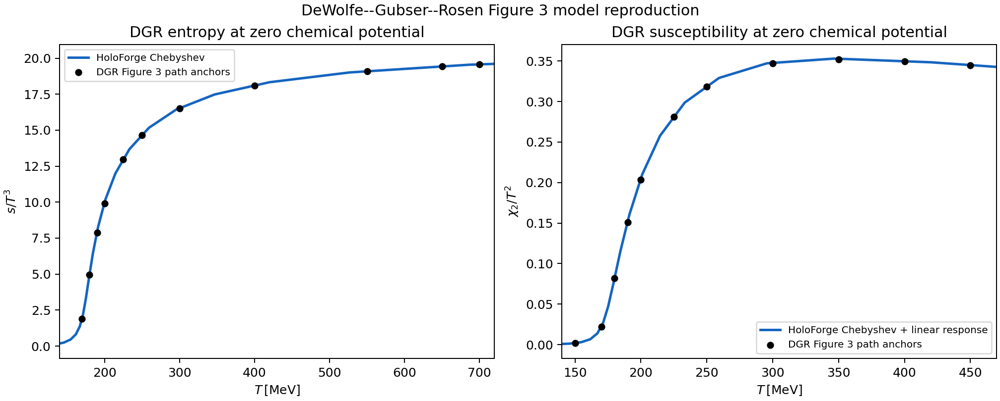

# DeWolfe--Gubser--Rosen EMD Phase 5A benchmark

## Scope and present review state

This Forge/Verify benchmark runs the owner-approved Phase 5A reproduction for the
phenomenological bottom-up EMD model in O. DeWolfe, S. S. Gubser, and C. Rosen,
“A holographic critical point,” Phys. Rev. D 83, 086005 (2011),
[arXiv:1012.1864v2](https://arxiv.org/abs/1012.1864). Its bounded target is the
pair of zero-density black-hole curves in source Figure 3:

- the normalized entropy density `s/T^3`; and
- the normalized baryon susceptibility `chi_2/T^2`.

Xin-Yi Liu approved the contract, implementation, numerical result, model
card, and material AI provenance on 2026-08-22. A passing command therefore
reports `reproduced`. This is reproduction of the selected source-model
calculation, not empirical validation of QCD, the lattice data shown in the
paper, or the finite-density critical point.

## Model, ensemble, and source dictionary

The five-dimensional action uses `L = 1` and `kappa_5^2 = 1` before source
rescalings. The frozen source functions are

```text
V(phi) = -12 cosh(0.606 phi) + 2.057 phi^2,
f_EMD(phi) = sech[(6/5)(phi-2)] / sech(12/5).
```

Phase 5A fixes zero chemical potential. The Maxwell field is an infinitesimal
linear response on a neutral Einstein--scalar background; no charged
black-hole background is solved. The source scale dictionary is retained
exactly as displayed rather than refitted:

```text
lambda_s = (121 MeV)^3,  lambda_T = 252 MeV,
lambda_mu = 972 MeV,    lambda_rho = (77 MeV)^3.
```

The approximately `0.6%` mismatch between the two rounded scale products is
recorded as source rounding and is not hidden by changing a parameter.

## Primary spectral route

The primary route reuses HoloForge's maintained UV-factorized neutral
Chebyshev BVP with

```text
x = z^(4-Delta_phi),      u = x/x_H,
phi = x_H u P(u),         P(0) = 1,
A = -log(z) + x_H^2 u^2 C(u),
h(0) = 1,                 h(1) = 0.
```

Twenty physical horizon values are spaced uniformly in `log(phi_H)` from
`1.5` to `7.5`. Every physical target is solved in the frozen order
`N = 80 -> 120 -> 150`; a high-degree state is never accepted from horizon
continuation alone. The undivided scalar equation is retained at the exact
horizon, so regularity is imposed rather than fitted.

The zero-density susceptibility follows the source linear-response integral

```text
I = integral dz exp(-A) / f_EMD(phi),
chi_2/T^2 = 1 / (2 I T^2),
```

with source scales applied only after the dimensionless black-hole result is
formed.

## Independent routes and acceptance gates

The calculation fails closed unless all fourteen frozen gates pass:

- analytic identities for the potential, gauge function, UV dimension, and
  source scale dictionary;
- library success and a scaled collocation residual at `1e-8`;
- independently oversampled equations and Einstein constraint at `1e-6`;
- exact endpoint, UV, and retained horizon-scalar residuals at `1e-8`;
- physical-horizon target error at `1e-9` and a one-to-one branch;
- aligned `80 -> 120 -> 150` observable refinement at `2e-4`;
- Gauss--Legendre susceptibility refinement at `2e-5`;
- an explicit DOP853 Maxwell response at `1e-6` with normalized flux drift at
  `1e-8`;
- a scalar-coordinate DOP853 master-equation background comparison at `5e-4`;
- absolute Figure 3 entropy and susceptibility anchor errors at `0.15` and
  `0.005`;
- duplicate complete-run observable determinism at `1e-12`; and
- strict finite JSON plus the public-source-only Phase 5A boundary.

The Figure 3 references contain derived public vector-path anchors. They do
not redistribute source artwork or third-party lattice points.

## Commands and artifacts

After installation:

```bash
holoforge verify dewolfe-gubser-rosen-emd
holoforge verify dewolfe-gubser-rosen-emd --json
holoforge verify dewolfe-gubser-rosen-emd --output-dir OUTPUT_DIR
python3 -m unittest tests.test_dewolfe_gubser_rosen_emd -v
```

The output directory receives a strict JSON record, the computed curve as CSV,
and a two-panel Figure 3 comparison. Existing artifact files are never
overwritten silently.

The full frozen scientific and numerical contract is in
[`dewolfe-gubser-rosen-emd-contract.md`](dewolfe-gubser-rosen-emd-contract.md).

## Current approved reproduction evidence

The owner-approved 2026-08-22 reproduction passes all fourteen frozen gates. Its
largest values are:

- scaled collocation residual: `9.313322e-10` against `1e-8`;
- independently oversampled equation residual: `5.847086e-10` against `1e-6`;
- Einstein-constraint residual: `1.505612e-12` against `1e-6`;
- final spectral observable change: `5.551312e-11` against `2e-4`;
- explicit Maxwell response/flux value: `1.625296e-9` against the stricter
  applicable `1e-8` flux ceiling;
- Chebyshev--DOP853 observable difference: `1.163957e-6` against `5e-4`;
- Figure 3 entropy anchor error: `0.08398744` against `0.15`;
- Figure 3 susceptibility anchor error: `0.002607142` against `0.005`; and
- duplicate-run physical-observable difference: exactly `0` against `1e-12`.

These support only the bounded Figure 3 source-model reproduction. They do not
support empirical QCD agreement or any finite-density claim.



The complete approved JSON record and curve CSV are stored beside the figure
under `docs/generated/dewolfe-gubser-rosen-emd/`.

## Phase 5B boundary

The later finite-density Phase 5B requires reproduction of source Figure 5 and
the paper's reported model critical point. Source Figure 4 is not a required
reproduction target; it may be used only when charged-scan coverage or branch
topology needs a diagnostic. Phase 5B, critical exponents, and any later-phase
publication or release action remain closed until a separate owner decision;
the approved Phase 5A integration and release do not open them.
