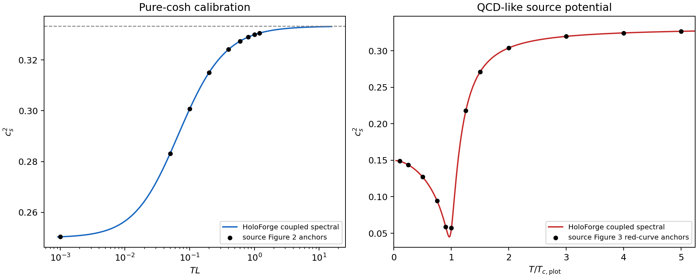

# Gubser--Nellore Einstein--dilaton benchmark

## Scope

This Forge/Verify benchmark reproduces two zero-density thermodynamic curves
from S. S. Gubser and A. Nellore, “Mimicking the QCD equation of state with a
dual black hole,” Phys. Rev. D 78, 086007 (2008),
[arXiv:0804.0434v2](https://arxiv.org/abs/0804.0434):

- the pure-cosh calibration curve in source Figure 2; and
- the red QCD-like black-hole curve in source Figure 3.

The calculation verifies an implementation of one classical bottom-up
Einstein--scalar model. It is not empirical validation of QCD, a top-down
embedding, an EMD calculation, or iHQCD.

## Model and conventions

In five bulk dimensions, with `L = 1` and `kappa_5^2 = 1`, both presets use

```text
V(phi) = -12 cosh(gamma phi) + b phi^2.
```

The pure-cosh preset has `(gamma,b) = (1/sqrt(6),0)`. The QCD-like preset has
`(gamma,b) = (0.606,2.06)`. There is no Maxwell field and the chemical
potential is zero.

The primary route uses conformal radial gauge and

```text
x = z^(4-Delta),          u = x/x_H,
phi = x_H u P(u),         P(0) = 1,
A_E = x_H^2 u^2 C(u),
f(0) = 1,                 f(1) = 0.
```

The coupled blackening, warp, and scalar equations are imposed on the exact
finite interval. The scalar equation is retained at `u = 1`; its horizon row
therefore enforces regularity rather than fitting an extra horizon datum.

## Numerical route

The implementation uses NumPy/SciPy and the shared Chebyshev--Lobatto grid.
The dense displayed curves use the primary degree `N = 80`. Independent
three-level verification branches use:

- `N = 40, 60, 80` for the pure-cosh preset; and
- `N = 80, 120, 150` for the QCD-like preset.

At the first horizon, degree continuation initializes the solve. The dense
primary curve then uses only the preceding `N = 80` horizon. At each reported
QCD-like verification horizon, the frozen order is `80 -> 120 -> 150`; each
higher degree is initialized from the converged current-horizon lower degree
and must pass its own high-degree gates.

Every collocation solve first uses
`scipy.optimize.root(method="hybr", xtol=1e-11)`. A failed or insufficient
root iterate receives the preregistered twelve-evaluation
`least_squares(method="trf")` polish. No best-of-restart selection is used.

The primary branch contains 260 pure-cosh points for the default `anchor`
profile, 700 for the extended `figure` profile, and 526 QCD-like points for
both. The independently oversampled equation, endpoint, refinement, and
DOP853 gates use 100 pure-cosh and 106 QCD-like verification horizons.

## Thermodynamics and source-figure comparison

Temperature and entropy are extracted at the exact horizon. The sound speed
is

```text
c_s^2 = d log(T) / d log(s).
```

The reported curve uses a local shape-preserving derivative. A local
barycentric derivative in `phi_H` is retained as an independent thermodynamic
cross-check.

The source Figure 2 comparison uses `T L` directly. Figure 3 requires the
single declared horizontal registration

```text
T_c_plot = T_minimum / 0.9618971489.
```

`T_c_plot` is a plot coordinate normalization, not a predicted critical
temperature. The comparison uses frozen numerical anchors derived from the
public Mathematica-generated EPS paths. Raw source figures are not
redistributed. The two packaged reference records retain the source-archive
digest, extraction rule, and conservative digitization uncertainties.

## Acceptance evidence

The verifier fails closed unless all of the following pass:

- analytic potential and UV/IR identities;
- nonlinear status and `1e-9` scaled collocation residual;
- all three physical equations on an independently evaluated `2N` grid at
  `1e-7`, including exact endpoints and the horizon scalar equation;
- three-level thermodynamic refinement at `2e-4` with an explicit numerical
  ordering floor;
- five scalar-coordinate DOP853 comparisons at `5e-4` relative error;
- barycentric versus shape-preserving sound-speed derivatives at `1e-3`;
- Figure 2 and Figure 3 anchor errors at `1.5e-3` and `5e-3`;
- branch integrity and a duplicate complete-run physical-observable
  determinism check at `1e-12`, scaled by the maximum of one and the two
  magnitudes;
  and
- JSON, human output, evidence-bundle, schema, packaging, and regression
  checks.

The complete frozen source and numerical contract, including classified
technical stops and owner decisions, is in
[`gubser-nellore-ed-contract.md`](gubser-nellore-ed-contract.md).

## Commands

After installation:

```bash
holoforge verify gubser-nellore-ed
holoforge verify gubser-nellore-ed --json
holoforge verify gubser-nellore-ed --profile figure --output-dir OUTPUT_DIR
python3 -m unittest tests.test_gubser_nellore_ed -v
```

The output directory receives the complete JSON record, a CSV of both primary
curves, and a two-panel PNG reproduction. Existing artifact files are never
overwritten silently.

## Current automated result



The 2026-08-16 extended `figure` profile passes all fourteen declared gates.
Its largest values are:

- scaled collocation residual: `9.37e-10` against `1e-9`;
- independently oversampled equation residual: `9.41e-8` against `1e-7`;
- final thermodynamic refinement change: `9.33e-9` against `2e-4`;
- coupled-versus-DOP853 relative difference: `1.14e-9` against `5e-4`;
- thermodynamic derivative disagreement: `4.41e-4` against `1e-3`;
- Figure 2 maximum anchor error: `7.31e-5` against `1.5e-3`;
- Figure 3 maximum anchor error: `1.42e-3` against `5e-3`; and
- duplicate-run physical-observable difference: exactly `0` in the recorded
  state against `1e-12`.

The Figure 3 registration gives `T_c_plot L = 0.8132232321` and a computed
minimum `c_s^2 = 0.0449714358`. These are source-model and plot-registration
quantities, not empirical QCD measurements or a predicted physical critical
temperature. The complete machine record and curve CSV are under
`docs/generated/gubser-nellore-ed/`.

## Review and limitations

The implementation, derived-anchor records, model card, and reproduced claim
are materially AI-assisted and were approved by Xin-Yi Liu on 2026-08-17.
Human approval does not erase the AI provenance or strengthen the support
beyond `reproduced`. No private Mathematica notebook, private filesystem path,
unpublished hypothesis, or private result is part of the public
implementation.
