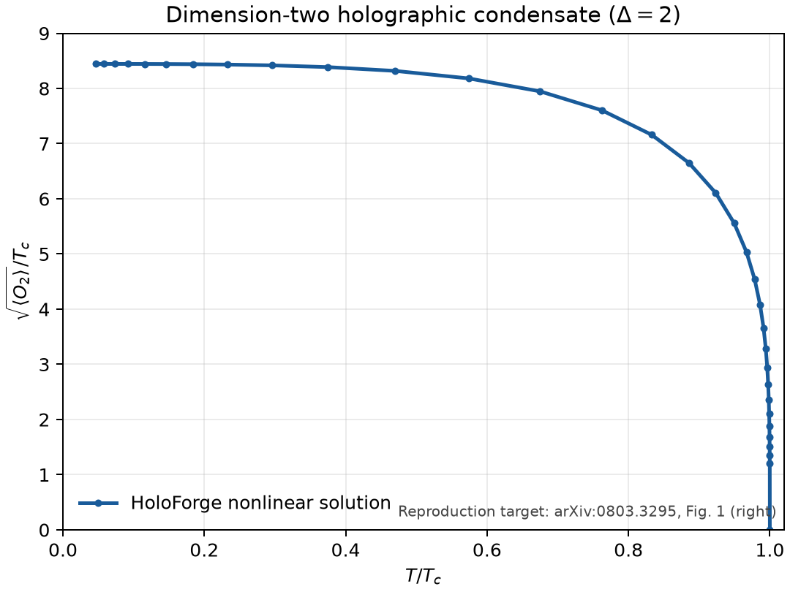

# Minimal holographic superconductor

## Verification target

This benchmark reproduces the minimal probe-limit model in:

> Sean A. Hartnoll, Christopher P. Herzog, and Gary T. Horowitz,
> “Building an AdS/CFT superconductor,” arXiv:0803.3295v1,
> Phys. Rev. Lett. 101, 031601 (2008).

The selected target is the dimension-two theory and therefore the observable
shown in the **right panel of Figure 1**:

```text
x = T/T_c
y = sqrt(<O_2>)/T_c
```

The output figure is regenerated from HoloForge solutions. The source image is
not copied or redistributed.



## Equations

Use `u = r_h/r`, set `L = r_h = 1`, and define `f = 1 - u^3`. With a real
scalar `psi(u)` and electric potential `A_t = phi(u)`, the equations are

```text
psi'' + (f'/f - 2/u) psi'
     + [phi^2/f^2 + 2/(u^2 f)] psi = 0,

phi'' - 2 psi^2 phi/(u^2 f) = 0.
```

The mass and charge conventions are `m^2 L^2 = -2` and `q = 1`.

## Boundary conditions and sources

At the UV boundary,

```text
psi = psi_- u + psi_+ u^2 + ...,
phi = mu - rho u + ... .
```

The dimension-two quantization sets `psi_- = 0`; this is the vanishing scalar
source. The chemical potential `mu` is a different source and remains nonzero.
The response is normalized as `<O_2> = sqrt(2) psi_+`, following source Eq.
(10).

At the horizon,

```text
phi(1) = 0,
psi'(1) = 2 psi(1)/3.
```

## Independent numerical layers

The linear onset calculation uses the normal solution
`phi = mu (1-u)`. Shooting on `mu/r_h` gives

```text
mu_c/r_h       = 4.06371366...
T_c/mu         = 0.05874735...
T_c/sqrt(rho)  = 0.11842676...
```

The last value reproduces the source's rounded `0.118` result.

The nonlinear calculation then continues solutions by increasing the horizon
scalar value. Each solution supplies `mu`, `rho`, and `psi_+`. Scaling to a
fixed-density presentation gives the Figure 1 axes without changing the bulk
solution.

Near the transition, the computed data are checked against source Eq. (12):

```text
<O_2> approximately 144 T_c^2 sqrt(1 - T/T_c).
```

## Run the verifier

```bash
holoforge verify holographic-superconductor
```

Save the dimension-two condensate plot:

```bash
holoforge verify holographic-superconductor \
  --plot artifacts/holographic-superconductor-delta2.png
```

Emit all curve points and numerical evidence as JSON:

```bash
holoforge verify holographic-superconductor --json
```

Plotting requires the optional dependency installed by either
`python3 -m pip install -e ".[plot]"` or the development installation
`python3 -m pip install -e ".[test]"`.

## Interpretation limits

The calculation uses the probe limit. At sufficiently low temperature the
matter fields become large and metric backreaction can no longer be neglected.
The low-temperature curve is therefore a reproduction of the stated
approximation, not a controlled zero-temperature ground state.

The boundary U(1) is a global symmetry in the minimal holographic dictionary.
Calling the phase a superconductor assumes that this current is weakly gauged;
without that extra step, “charged superfluid” is the more precise description.
